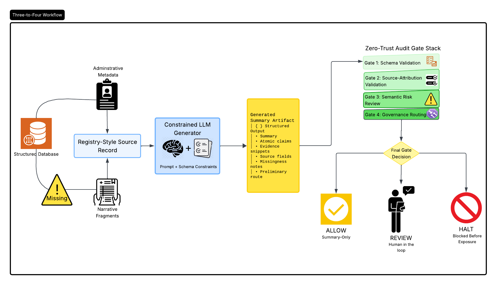

# Zero-Trust Audit Pipeline for Clinical LLM Summaries 

This repository contains a public synthetic methodological case study and prototype code for auditing LLM-generated clinical summary artifacts. The pipeline routes generated summaries through schema validation, source-attribution validation, semantic risk labeling, and rule-based governance gating.

This public version uses synthetic and abstracted registry-style examples. It does not include patient-level data, real clinical text, institutional identifiers, or unapproved internal results.

## Table of contents 
- [Summary](#summary)
- [Case setting and deployment risk](#Case-setting-and-deployment-risk)
- [Zero-trust audit pipeline](#Zero-trust-audit-pipeline)
    - [Methodology](#Methodology)
- [Synthetic demonstration and failure-mode taxonomy](#Synthetic-demonstration-and-failure-mode-taxonomy)
    - [Audit Signals and Gate Responses](#Audit-Signals-and-Gate-Responses)
    - [Abstracted review example](#Abstracted-review-example)
- [Governance implications and limitations ](#Governance-implications-and-limitations )

## Summary

Clinical large language models (LLMs) are increasingly proposed for summarization, chart review, and documentation support, but fluent and schema-valid outputs may still contain verification failures that pose deployment-relevant risks. This synthetic methodological case study presents the design and demonstration of a zero-trust audit gate for LLM-generated clinical summaries using registry-style clinical records. The pipeline routes each generated summary through four control layers: (1) structured schema validation, (2) normalized source-attribution validation, (3) semantic risk review, and (4) final governance routing. The case study focuses on two auditability failure modes: quote stitching, where a model constructs unverifiable evidence snippets from true facts, and unsupported comparative reasoning, where a summary presents baseline or cohort-level comparisons not present in the record. This report shows how generated clinical summaries can be treated as auditable artifacts and routed to summary-only use, human review, or halt decisions before downstream exposure. The case illustrates how clinical LLM governance can move beyond benchmark accuracy toward traceable, source-grounded, and workflow-aware deployment controls.

## Case setting and deployment risk 

Clinical environments are typified by fragmented documentation, where essential patient data is usually dispersed across patient health databases, administrative metadata, and unstructured clinical narratives. Large Language Models (LLMs) provide a method for combining these fragments into unified clinical summaries, but linguistic coherence can shroud critical deployment risks. A generated summary may seem clinically plausible but can simultaneously introduce unsupported claims, unverifiable source attributions, or reasoning that goes beyond the underlying patient record.
This synthetic methodological case study examines a registry-style maternal health setting. Clinical registries often contain asymmetric missingness, where variables like length-of-stay, interpreter utilization, care-transition status, or historical baselines may be unavailable, inconsistently recorded, or not comparable across patient cohorts. These structural gaps matter for deployment as an LLM may still generate continuous prose even when the source contains uncertainty or absence. In an unconstrained workflow, this can cause the model to smooth over missing data with confident but insufficiently verified assumptions about patient risk, care-transition status, or cohort-level context.
The deployment risk is therefore not limited to obvious hallucination. A summary can be factually plausible yet remain audit-unsafe if its evidence trail cannot be verified. This framework isolates two failure modes that may emerge under sparse registry conditions: 
•	Quote Stitching: where the model constructs citation-like evidence by joining non-contiguous source text, section labels, or list fragments;
•	Unsupported Comparative Reasoning: where the model introduces cohort-level judgments, median comparisons, baseline statements, or relative-risk framing that does not appear in the individual source record.
In both cases, the issue is not only whether the summary “sounds correct,” but whether its claims and reasoning can be traced to the available evidence.
Rather than estimating population-level error rates or validating clinical performance, this study demonstrates a pre-deployment audit workflow for clinical LLM summaries. The proposed architecture serves as a zero-trust gate that routes generated outputs to summary-only use, human review, or halt decisions before downstream workflow exposure.

## Zero-trust audit pipeline

The audit architecture treats an LLM-generated clinical summary as a target artifact instead of a directly deployable clinical document. The pipeline is data-origin agnostic: it can be applied to real, de-identified, or synthetic registry-style records, as long as the source record, generated output, expected schema, and governance rules are available. The auditor does not need access to the Generator model's training data, internal weights, or proprietary configuration, exhibiting a practical deployment setting where outputs must be evaluated independently of the model provider.

The workflow converts a registry-style record into a structured summary artifact containing summary text, atomic claims, declared source fields, evidence snippets, missingness notes, and preliminary routing metadata. This design shifts evaluation away from paragraph-level fluency toward claim-level checks of traceability, evidence consistency, and deployment risk. 

## Methodology

This public case study uses synthetic and abstracted registry-style records based on constraints observed in internal clinical-registry audit work. The examples were recreated to preserve the methodological structure of the original problem- fragmented fields, narrative text, metadata, and missingness- without disclosing patient-level data, institutional identifiers, real clinical text, or unapproved results. The prototype was implemented in Python: generated summaries were structured into atomic claims, evidence snippets, source fields, missingness notes, and routing metadata, then passed through schema checks, source-attribution matching, semantic risk labeling, and rule-based gate assignment. Aggregate audit logs were produced internally, but exact cohort sizes, case counts, and run-level metrics are omitted from this public version pending data-owner approval.

The first audit layer is schema validation. This layer verifies whether the generated artifact is complete, parseable, and structurally compatible with downstream review. A schema-valid output is not treated as clinically correct; it is only considered structurally auditable. Malformed, incomplete, or unparsable outputs are halted because later interpretation would be unreliable.

The second audit layer is source-attribution validation. This layer evaluates whether each declared evidence snippet can be traced to the claimed source section using normalized matching procedures such as lowercasing, whitespace normalization, punctuation handling, and token-sequence comparison. The purpose is to detect provenance failures such as missing evidence, source-section mismatch, or quote stitching. A claim may be directionally plausible, but if its evidence trail cannot be verified, the artifact is not ready for unreviewed workflow exposure.

The third audit layer is semantic risk review. This layer does not function as an automated clinical truth oracle. Instead, it assigns claim-level risk labels based on whether each atomic claim appears supported, partially supported, unsupported, contradicted, or insufficiently evidenced. It also flags reasoning patterns that deterministic attribution checks may miss, such as unsupported comparisons, missing comparator data, critical omissions, automation overreach, and checklist over-reliance. 
These labels are treated as governance signals rather than final clinical adjudications.

The final layer is governance routing. The gate converts audit findings into one of three routing decisions: ALLOW, HUMAN REVIEW, or HALT. Outputs with no detected blockers may be retained only as limited summary-support artifacts. Outputs with partial support, unverifiable attribution, unsupported comparisons, critical uncertainty, or missingness-related ambiguity are routed to human review. Outputs with malformed structure, privacy leakage, or severe contradicted claims are stopped before downstream exposure. The gate determines whether a generated summary can be viewed as a constrained support artifact, requires human mitigation, or must be blocked entirely.

## Synthetic demonstration and failure-mode taxonomy

The synthetic demonstration was designed to stress the audit method under registry-style conditions rather than to estimate model performance. The recreated records varied source completeness, missingness patterns, and prompting context so that the same audit pipeline could be examined under different traceability conditions. Prompt settings ranged from minimally constrained summarization to audit-aware and workflow-oriented instructions.

## Audit Signals and Gate Responses

| Audit Finding | Signal | Gate Response |
|---|---|---|
| Quote stitching | Evidence snippet is unmatched or assembled from non-contiguous source fragments. | **HUMAN REVIEW** |
| Unsupported comparative reasoning | Claim introduces a median, baseline, cohort comparison, or relative-risk frame absent from the source record. | **HUMAN REVIEW** |
| Privacy leakage | Output includes patient-, institution-, or identifier-like information outside the permitted schema. | **HALT** |
| Severe contradicted claim | Claim conflicts with or reverses a high-salience source field. | **HALT** |
| No detected blocker | Structure is valid, evidence is traceable, and no major safety or reasoning flags are detected. | **ALLOW** |

## Abstracted review example

In one recreated demonstration pattern, the source record carried an individual vulnerability-related field but did not provide a cohort median, reference distribution, or comparison group. The generated summary nevertheless framed the patient as being “above median” relative to a broader population. The issue was not that the individual field was absent; rather, the comparative framing exceeded the available evidence. Under the zero-trust gate, this type of output is routed to HUMAN REVIEW rather than ALLOW, since a downstream user could incorrectly treat the unsupported comparison as evidence-based.

## Governance implications and limitations 
This demonstration suggests that prompt context can influence the auditability of generated summaries. Prompts that required missingness acknowledgment and governance-aware reasoning produced more conservative artifacts in the examples, while workflow-oriented prompts could encourage summaries that were structurally plausible but less traceable. These observations are not interpreted as clinical error rates or prompt-performance benchmarks. Instead, they serve as examples of how deployment context can influence whether generated summaries remain source-grounded and reviewable.

The primary contribution is methodological: generated clinical summaries are treated as auditable artifacts with separable dimensions of structural validity, evidence traceability, semantic support, and governance readiness. These dimensions determine whether a summary may be retained as a limited support artifact, routed to human review, or halted before downstream workflow exposure.

This public version has important limitations. It is a synthetic methodological case study, not a clinical validation study, performance benchmark, or autonomous clinical decision-support system. The semantic labels should be interpreted as governance signals rather than final clinical adjudications. Future work would require approved clinical data access, clinician review, larger run logs, and reliability testing before the pipeline could be evaluated as a deployable clinical safety system.

